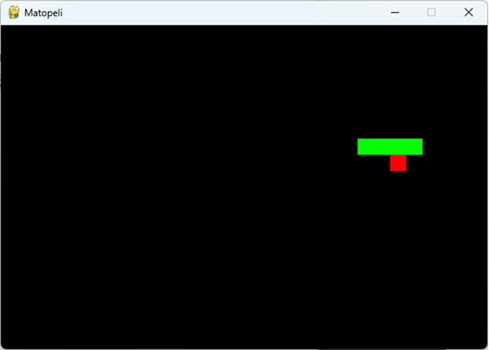

# Matopeli - Testausta ja CI/CD

Pieni Pythonilla tehty klassinen matopeli.  
Toteutettu `pygame`-kirjastolla ja julkaistu `.exe`-muodossa automaattisesti GitHub Actionsin avulla.

[](https://github.com/MipoRepo/matopeli/releases)

[](https://github.com/MipoRepo/matopeli/releases)

---

## Näyttökuva



---

## 🎮 Ohjeet

- Käynnistä peli tuplaklikkaamalla `matopeli.exe`
- Ohjaa matoa nuolinäppäimillä
- Syö punaiset ruuat kasvattaaksesi matoa
- Älä törmää seinään tai itseesi!

---

## Testaus

Projektissa käytetään `pytest`-yksikkötestejä ja `pytest-cov`-kattavuusraportointia.  
Testit ajetaan automaattisesti GitHub Actionsin CI-putkessa jokaisen commitin yhteydessä.

```bash
pytest --cov=. --cov-report=html
```

---

## ⚙️ Kehittäjille

### Asenna riippuvuudet:

```bash
python -m venv .venv
source .venv/bin/activate  # Windows: .venv\Scripts\activate
pip install -r requirements.txt
```

### Aja peli:

```bash
python matopeli.py
```

### Rakenna .exe-tiedosto (vaatii PyInstaller):

```bash
pyinstaller --onefile matopeli.py
```

---

##  Kehittäjä

[GitHub: MipoRepo](https://github.com/MipoRepo)

---

© 2025 Matopeli – avoin lähdekoodi MIT-lisenssillä
